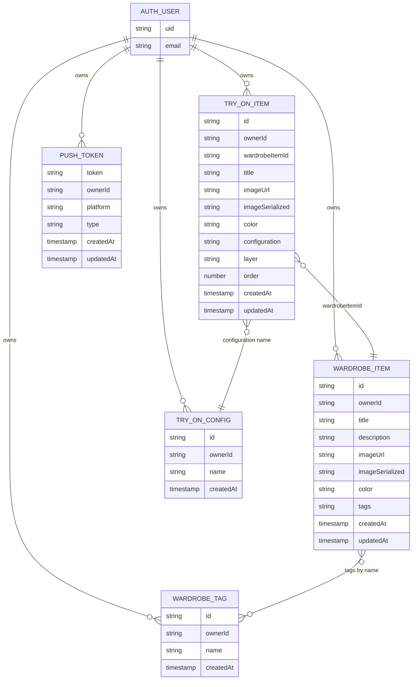
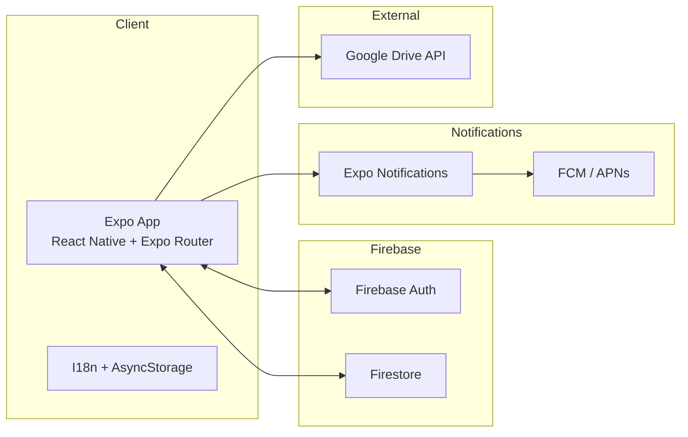
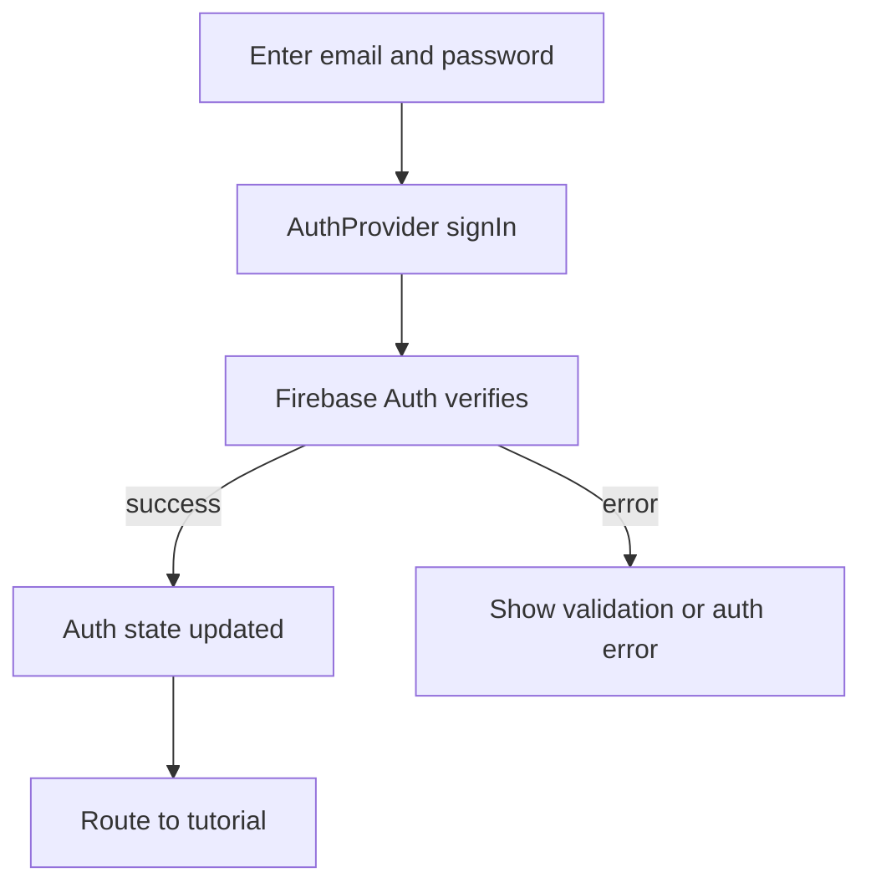
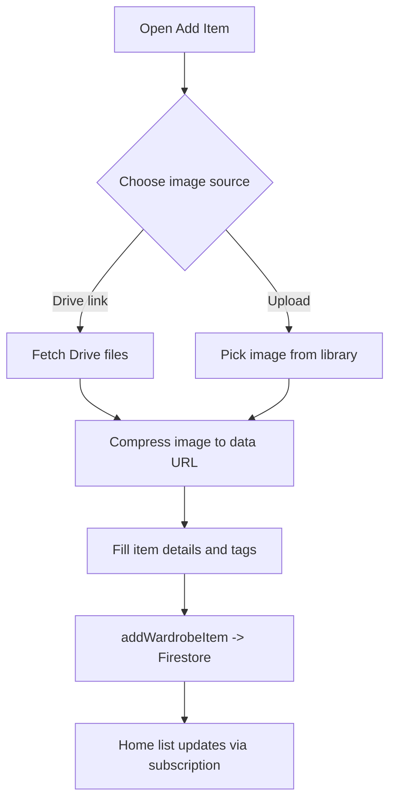
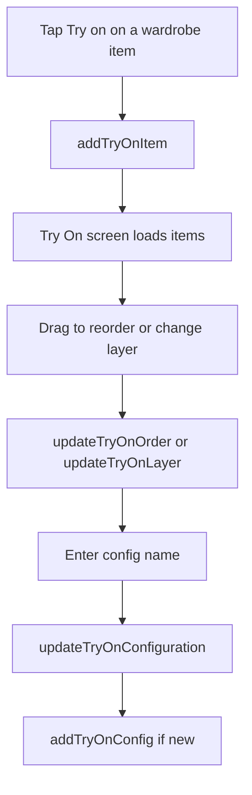

# MyWardrobe App Documentation

## App Introduction
MyWardrobe is a cross-platform wardrobe organizer built with Expo Router and Firebase. The app helps users catalog clothing items with photos, colors, and tags, then assemble "try-on" looks by layering items and saving named configurations.

## Target Audience
- People who want a visual inventory of their wardrobe on mobile or web.
- Users who need quick filtering by tags and a simple way to plan outfits.
- Bilingual users (English and Romanian) who want language switching.

## Technical Architecture (20 Points)

### Database Structure

#### Entity-Relationship Diagram (ERD)


#### Description
- Identity comes from Firebase Auth. There is no Firestore "users" collection; the ERD includes AUTH_USER to show ownership.
- Every document includes `ownerId` and the UI only queries data where `ownerId == currentUserId`.
- `wardrobeItems` stores item metadata. Images are stored as a URL or a small `imageSerialized` data URL to keep previews available without external hosting.
- `wardrobeTags` stores user-defined tags. Items store tag names directly in `tags` for simple filtering, which is denormalized but fast for queries.
- `tryOnItems` references a wardrobe item by `wardrobeItemId` and stores a `layer` and `order` to support drag-and-drop ordering.
- `tryOnConfigs` stores named configurations. `tryOnItems.configuration` stores the configuration name instead of an id, so renaming a configuration requires updating items.
- `pushTokens` stores Expo notification tokens for later push notification campaigns.

### Backend Architecture (if applicable)

#### Architecture Diagram


#### Description
- The app is client-first with no custom server. Authentication and data storage are handled by Firebase services.
- Firestore is accessed directly with the web SDK for real-time subscriptions and CRUD operations.
- Expo Notifications registers device tokens and stores them in Firestore so a future backend can send push notifications.
- Google Drive API is used client-side to list images from a shared folder link when creating items.
- AsyncStorage persists language choice and the active try-on configuration on the device.

## User Interface and Experience (15 Points)

### UI Wireframes/Screenshots
Replace these wireframes with real screenshots when available.

```
[Login]
+----------------------------------------+
| Language: [EN] [RO]                    |
| Organize My Wardrobe                   |
| Email:    [____________________]       |
| Password: [____________________]       |
| [Log in]                               |
+----------------------------------------+
```

```
[Home / Wardrobe Library]
+----------------------------------------+
| Wardrobe Library                       |
| Active try-on: "Weekend"               |
| [Filter tags] [2 selected]             |
| [Add new item]                         |
| -------------------------------------- |
| [Card] Title ... [Edit] [Try on] [Del] |
| [Card] Title ... [Edit] [Try on] [Del] |
+----------------------------------------+
```

```
[Add Item]
+----------------------------------------+
| Title        [______________]          |
| Description  [______________]          |
| Image URL    [______________]          |
| [Load Drive images]  [Upload image]    |
| Color        [______________]          |
| Tags: [Casual] [Summer] [Manage]       |
| [Save item]                            |
+----------------------------------------+
```

```
[Try On]
+----------------------------------------+
| Top layer:    [item] [item]            |
| Middle layer: [item]                   |
| Bottom layer: [item] [item]            |
| Save config: [name] [Save]             |
| Config list: [Work] [Weekend] [Delete] |
+----------------------------------------+
```

```
[Settings]
+----------------------------------------+
| Signed in as user@example.com          |
| Language: [EN] [RO]                    |
| [Sign out]                             |
+----------------------------------------+
```

```
[Tutorial]
+----------------------------------------+
| [Skip]                                 |
| Slide card text                        |
| [o] [o] [o]                            |
| [Next] / [Get started]                 |
+----------------------------------------+
```

### Design Rationale
- A card-based layout mirrors the idea of "items in a wardrobe" and keeps scanning easy.
- The warm neutral palette and soft corners match a personal, home-oriented product.
- Primary actions use a consistent accent color to reduce decision fatigue.
- Tag chips and filters support fast exploration without complex search UI.
- Drag-and-drop in the Try On screen matches the mental model of layering outfits.

## Key Features and Functionalities (20 Points)

### Feature List
- Email/password authentication via Firebase.
- Wardrobe library with add, edit, delete, and tag-based filtering.
- Image sourcing from URL, Google Drive folder, or local upload with compression.
- Tag management (create, select, delete) and quick filtering.
- Try On board with layered drag-and-drop ordering.
- Save and switch named try-on configurations.
- Language switching (English and Romanian) with persistence.
- Device push token registration for notifications.

### Event Flows

#### Flow 1: User Login


#### Flow 2: Add Wardrobe Item


#### Flow 3: Save Try On Configuration


## Accessibility and Internationalization (5 Points)

### Accessibility Features
- Uses native text inputs and Pressable buttons, which inherit platform accessibility defaults.
- Text labels are explicit for all form fields and actions.
- Tap targets use padding and chips to improve touch accuracy.

### Internationalization Approach
- English and Romanian strings are stored in JSON translation files.
- `I18nProvider` supplies `t()` and stores the active language in AsyncStorage.
- Language can be switched on the login and settings screens.

## Challenges and Learnings (10 Points)

### Development Challenges
- Cross-platform UI differences (web vs mobile) required conditional behavior for drag-and-drop lists and confirmation dialogs.
- Image ingestion had to handle large files; the app compresses images and enforces a size limit before storing data URLs.
- Realtime data with Firestore demanded careful filtering by `ownerId` and stable client-side sorting.

### Key Learnings
- Firestore subscriptions keep the UI responsive with minimal state management.
- Zod plus react-hook-form gives clear validation and reduces form errors.
- Persisting small preferences with AsyncStorage improves the onboarding experience.

## Future Enhancements (10 Points)

### Proposed Improvements
- Add a sign-up flow and password reset.
- Move image storage to Firebase Storage to avoid base64 limits.
- Add advanced filters (season, size, brand) and search.
- Expand the Try On experience with AI outfit suggestions.
- Add sharing or collaborative wardrobes.

### Roadmap
- Short term: sign-up, forgot password, image storage migration.
- Mid term: outfit recommendations, expanded tag filters, better analytics.
- Long term: new modules hinted in the tutorial (for example, fridge inventory) and richer push notifications.

## Appendix (10 Points)

### Code Snippets

#### Firestore subscription for wardrobe items
Source: `src/lib/firestore/wardrobeItems.ts`
```ts
export function subscribeToWardrobeItems(
  ownerId: string,
  onChange: (items: WardrobeItem[]) => void
) {
  const wardrobeQuery = query(wardrobeCollection, where("ownerId", "==", ownerId));

  return onSnapshot(wardrobeQuery, (snapshot) => {
    const items = snapshot.docs.map((doc) => ({
      id: doc.id,
      title: doc.data().title ?? "",
      // ...
    }));

    const sorted = items.sort((a, b) => {
      const aTime = a.createdAt?.getTime?.() ?? 0;
      const bTime = b.createdAt?.getTime?.() ?? 0;
      return bTime - aTime;
    });

    onChange(sorted);
  });
}
```

#### Drag-and-drop order updates with batch writes
Source: `src/lib/firestore/tryOnList.ts`
```ts
export async function updateTryOnOrder(items: TryOnItem[]) {
  const batch = writeBatch(db);
  items.forEach((item, index) => {
    const docRef = doc(db, "tryOnItems", item.id);
    batch.update(docRef, {
      order: index,
      updatedAt: serverTimestamp(),
    });
  });
  await batch.commit();
}
```

#### Image compression to data URL
Source: `app/(app)/add-item.tsx`
```ts
const compressImageToDataUrl = async (uri: string) => {
  for (const step of COMPRESSION_STEPS) {
    const actions = step.maxWidth ? [{ resize: { width: step.maxWidth } }] : [];
    const result = await ImageManipulator.manipulateAsync(uri, actions, {
      compress: step.quality,
      format: ImageManipulator.SaveFormat.JPEG,
      base64: true,
    });

    if (result.base64 && getBase64Size(result.base64) <= MAX_IMAGE_BYTES) {
      return `data:image/jpeg;base64,${result.base64}`;
    }
  }

  return null;
};
```

### References and Resources
- Expo and Expo Router
- Firebase (Auth, Firestore)
- Expo Notifications, FCM, APNs
- Expo Image Picker and Image Manipulator
- React Hook Form and Zod
- React Native Draggable FlatList
- AsyncStorage
- Google Drive API (folder file listing)
